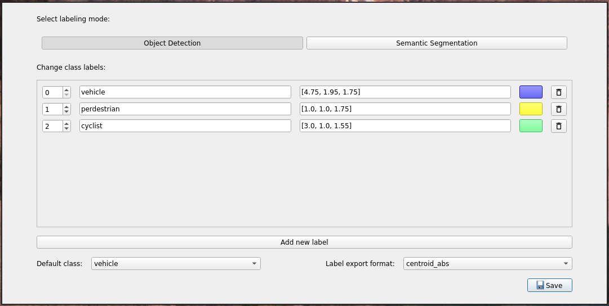
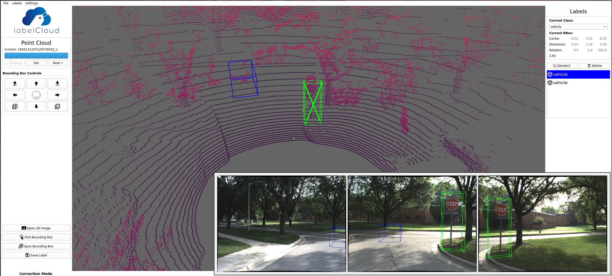

# Four Seasons modified labelCloud
Here you will find instructions for the installation and labelling processes. However, this only has the labelCloud code -- you need the full zipped download if you don't already have it. If you need it, ask your lead for it.

**Warning - This has been difficult to get running on Macs. There are added instructions, but you are likely to run into issues if you are on MacOS.**

Important notes/links:
- You can find the Waymo label specifications [here](https://github.com/waymo-research/waymo-open-dataset/blob/master/docs/labeling_specifications.md). This is what we'll use to guide consistency, so if you're unsure whether to label or not to label, check the Waymo spec.
- The process of converting the 3D bounding boxes into the 2D images currently has a large error value. We want the LiDAR labels to be as accurate as possible, so focus more on ensuring you have the full object in the pointcloud rather than fitting to the object on the image. In essence, use the images as a suggestion but not a direct guide.
- Commit your labels *to your branch* frequently. We don't want to lose samples randomly!
    - When comitting labels, remember that we only need to commit the label files


## Installation
As mentioned, first ensure you've downloaded and extracted the full zip. In your terminal, navigate to wherever you extracted it to.

You'll need to use Python 3.8 for labelCloud, which is no longer the standard Python version on most systems. To handle for this, we'll create a Conda environment, allowing us to operate in a separate env that is in Python 3.8 (this is sort of like how we use Docker for all of our ROS development).

To start, you'll want to grab the [Miniconda](https://docs.conda.io/projects/miniconda/en/latest/) version for your system. Follow the steps on their site to install it.
After installation, you can verify Conda is properly installed and set up by executing ``conda info``. If your installation was succesful, you should see a readout of various information:

```
     active environment : base
    active env location : $HOME/miniconda3
            shell level : 1
       user config file : $HOME/.condarc
 populated config files : 
          conda version : 23.5.2
    conda-build version : not installed
         python version : 3.11.4.final.0
       virtual packages : __archspec=1=x86_64
                          __glibc=2.35=0
                          __linux=6.2.0=0
                          __unix=0=0
       base environment : $HOME/miniconda3  (writable)
      conda av data dir : $HOME/miniconda3/etc/conda
  conda av metadata url : None
           channel URLs : https://repo.anaconda.com/pkgs/main/linux-64
                          https://repo.anaconda.com/pkgs/main/noarch
                          https://repo.anaconda.com/pkgs/r/linux-64
                          https://repo.anaconda.com/pkgs/r/noarch
          package cache : $HOME/miniconda3/pkgs
                          $HOME/.conda/pkgs
       envs directories : $HOME/miniconda3/envs
                          $HOME/.conda/envs
               platform : linux-64
             user-agent : conda/23.5.2 requests/2.29.0 CPython/3.11.4 Linux/6.2.0-34-generic ubuntu/22.04.3 glibc/2.35
                UID:GID : 1000:1000
             netrc file : None
           offline mode : False
```

> This printout is on a linux system -- if you're on something else, it may appear different. The gist should be the same, and it executing w/o error is the most important thing.

The most important part to note about the above info is the first line, ``active environment``.
This denotes the Conda environment you are currently in. It should say ``base`` directly after installation. Some systems will show the active env right on your command prompt, but in case it doesn't that is how you can check. 

Now create the environment we'll use to run our labelling software:
```
conda create -n <name> python=3.8 
```
Feel free to name the env as you please, just note the name you choose. Going forward we'll refer to it as 'label', but that is an arbitrary choice. If you name it something different, you'll just need to swap 'label' for your selected name.

Now enter the environment by executing:
```
conda activate label
```
You should now be in your env for the labelling software. Anything you do related to python is now specific to this environment, and is done in terms of Python 3.8.

Now we're going to replace the labelCloud you downloaded earlier with the updated one found here. Go ahead and delete the ``labelCloud_V2`` directory the download should've come with, and replace it with this repository. We're going to clone it as a git repo to ensure that we keep it tied to this repository -- there may be changes in the future. 

You should now be in the directory you extracted the zipped contents, and there should be no ``labelCloud`` (because you deleted it). You can now clone this repository via:
```
git clone https://github.com/schelcc/four-seasons-labelCloud.git
```
Or however else you see fit (e.g. via ssh instead). This may take a second, so don't kill it if it seems to hang. After it's fully cloned, you can verify you did it right by navigating inside it and executing
```
git status
```
If you get an error, something's not right. If you don't, you're good to move on.

For the final step here, we're going to install the required packages. To do this, ensure you're in the environment you created and you've navigated inside of the repository you just cloned. Once you've ensured as such, run:
```
pip install -r requirements.txt
```
This should run without error, and if it does then you are properly set up! If there were errors, reach out to your lead for assistance.


## Labelling Procedure
Before you can open the labelling software, you'll need samples. Check the sample division sheet that should've been shared with you (ask your lead if you don't have access), and pick a group of samples that hasn't yet been selected. Once selected, ask a lead for assistance in retrieving the corresponding samples. This requires VPN and dev server access, so you can't advance past this if you don't yet have that completed.

For the following steps, you are assumed to be currently in the main labelCloud directory. When copying samples to your local env, they should go to the 'pointclouds' folder. **Do not delete the ``_classes.json`` file**.

Once you have the samples copied over, go ahead and run the labeller just like you would any other python script (``$python3 labelCloud.py`` on linux).

Before the full tool start up, it will first confirm your class selection. This is pre set, so you can just confirm this.



Once the tool fully starts up, you should see something like:


You'll see the currently selected bounding box highlighted in green, and all others will be blue. In the upper left of the interface, you'll see a number of controls. The few directly under the loading-eqsue bar control which sample you currently have open -- use these to move to the next sample once you're done with your current sample. Directly below the sample controls are the bounding box controls. You can hover over the buttons to see directly what they do, but they all are just to manipulate the current bounding box in some way. At the bottom of the left side, you'll see buttons to open the current images, pick a bounding box, span a bounding box, and to save the label. Experiment with "pick" and "span" as they behave differently. Finally, make sure to save each label when they're complete!

To the right of the interface, you'll see a few things. At the top, you have the "current class" dropdown -- this just denotes what type of object the bounded feature is. The three we will focus on are 'vehicle', 'pedestrian', and 'cyclist'. Below that dropdown, you'll see some information about the bounding box itself. Below that, there's an option to deselect the current bounding box and an option to delete the current bounding box. Finally, under those you'll find a list of all bounding boxes in the current sample. You can click on these to select different bounding boxes in the current sample.

There's a number of shortcuts to speed up the labelling process which can be found at [the original project](https://github.com/ch-sa/labelCloud). You are *highly* encouraged to learn these.

Go ahead and experiment around with a sample or two to get the hang of the software, then get labelling!